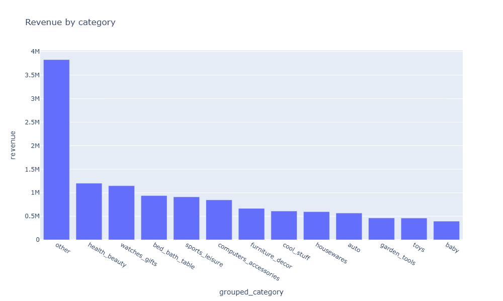
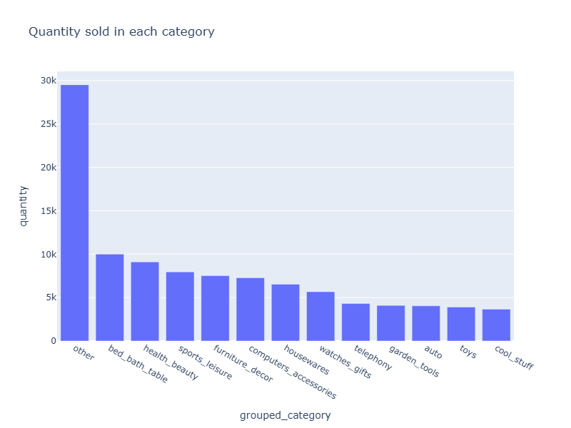
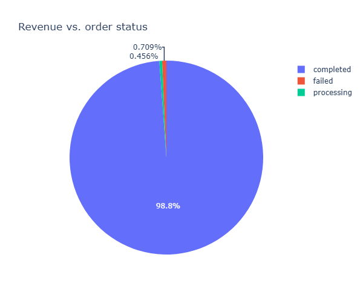
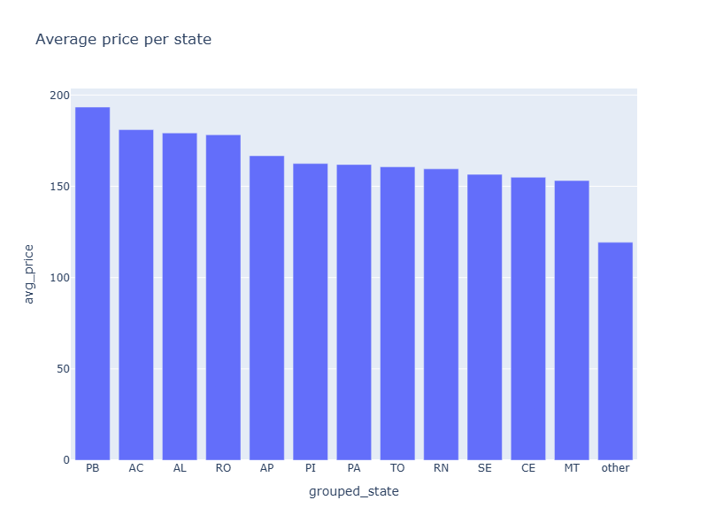
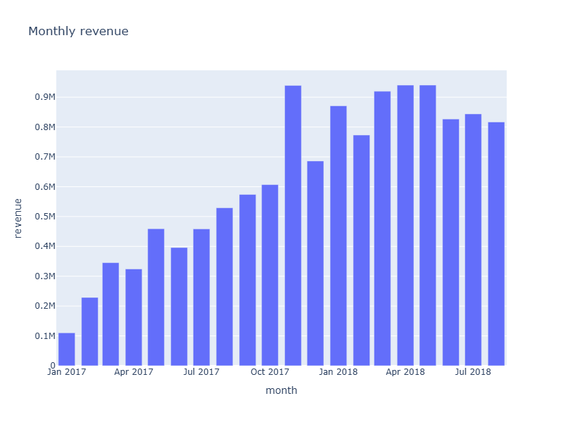
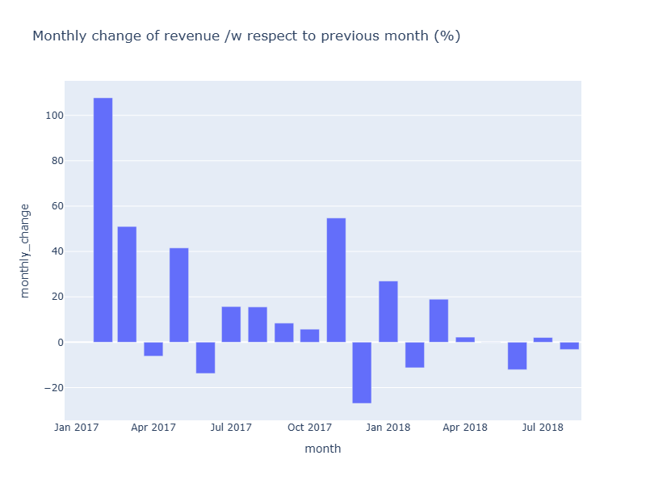
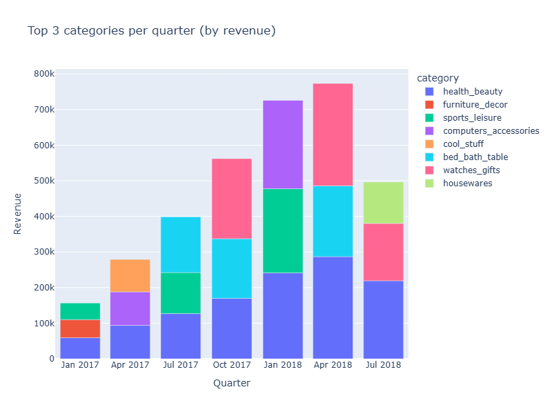
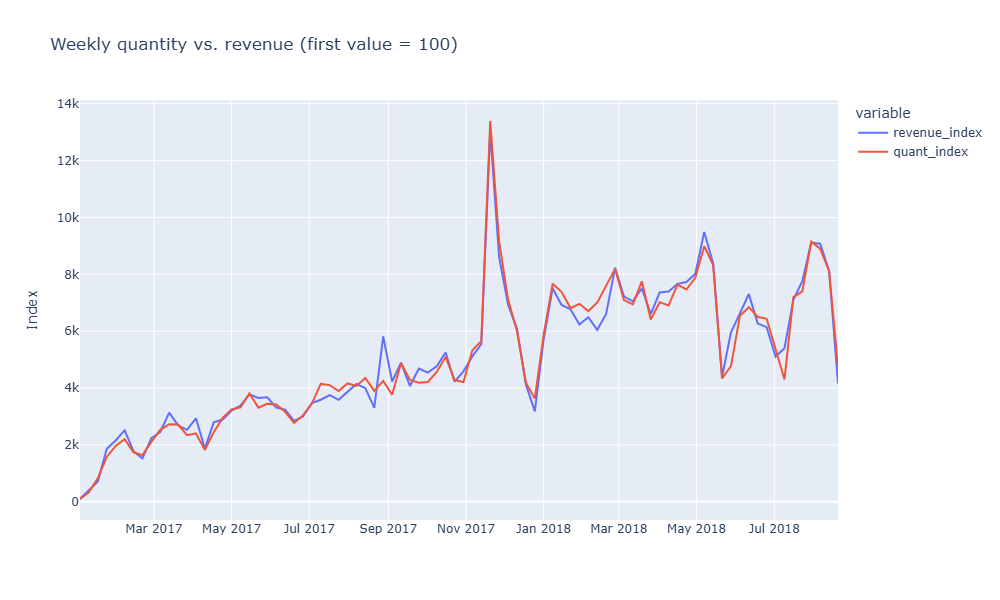

## Brazillian e-commerce dataset analysis

* Data source: [LINK](https://www.kaggle.com/datasets/olistbr/brazilian-ecommerce?select=product_category_name_translation.csv)

Data schema of the dataset (image taken from the source site).

-----
### Introduction

* This dataset is big. To clean it and validate it I need a bit of time. For now I will focus on what I think is the core of the dataset:
    1. `orders`
    2. `order\_items`
    3. `customers`
    4. `products`

* I will also add a table with translations of the categories provided by the data poster.
* Apart from that there is information about reviews, payments, sellers and geolocation of the actors. This will come after the core analysis.
* According to the poster of this dataset the data is real and therefore some columns were anonymized (e.g. by replacing companies' names with Game of Thrones house names).

-----
* I proceeded as follows:
    1. Load the datasets into SQL.
    2. Clean the datasets into SQL & prepare theirs ready-to-analyze versions.
    3. Join & aggregate.
    4. Load the aggregated data into Python for furhter analysis and vizualisation.

* I focused on cleaning customers well:
    1. Checking NULLs
    2. Fake NULLs ('', 'n/a', 'null')
    3. Flagging the header row
    4. Looking for impossible values and unnecessary symbols
    5. Flagging duplicate rows
    6. Flagging duplicate customer\_id's - since I do not know how to interpret them

* For the customers table I followed the 'raw -> stage -> clean -> analysis pipeline', where I first load the raw data, remove unnecesary symbols, flag duplicates, NULLS in the staging table, then exclude the flagged rows in the clean table & finally create a proper table with correct types & constraints, called 'analysis'.
* For the rest of the tables I sometimes skipped the clean stage, since there was not much to be cleaned and make it usable. The rest of the tables were made sure to be joinable, checked for NULLs, fake NULLs, duplicates & have had the header row deleted. All of them had correct column types & constraints applied.
* I created a 'main' table compiling the most important information for a primary analysis. It contains:
    1. `order_id`
	2. `customer_id`
	3. `order_status`
	4. `item_id`
	5. `product_id`
	6. `category`
	7. `price`
	7. `shipping`
	9. `order_date`
	10. `state` (region)

-----
### Analysis results

* Top categories by revenue generated:
    1. `health_beauty`
    2. `watches_gifts`
    3. `bed_bath_table`
    4. `sports_leisure`
    5. `computers_accessories`
    6. `furniture_decor`
    7. `cool_stuff`
    8. `housewares`
    9. `auto`
    10. `garden_tools`
    11. `toys`
    12. `baby`
* Together the top 12 categories account for 70% of the total revenue generated within the analyzed period.

-----

* Top categories by amount of items sold:
    1. `bed_bath_table`
    2. `health_beauty`
    3. `sports_leisure`
    4. `furniture_decor`
    5. `computers_accessories`
    6. `housewares`
    7. `watches_gifts`
    8. `telephony`
    9. `garden_tools`
    10. `auto`
    11. `toys`
    12. `cool_stuff`
* Similarly, the top 12 categories account for almost 72% of total amount of items sold within the analyzed period.

-----

* Revenue loss stemming from cancelled orders lays below 1% of the revenue's total.

-----

* The average price in the top 12 states differs slightly, reaching its maximum in PB. 
* The rest of the states' average suggests that much cheaper items are bought in the bottom states.

-----

* The quantile bucket distribution shows that none of the buying groups account for more revenue than the others. All customer groups contribute to the revenue equally, those who buy cheap and those who buy expensive, alike.

-----

* One can observe a significant rise of monthly revenue from January 2017 until November 2017, after which the monthly revenue more or less plateaus.

-----

* A clear pattern of increases with regards to the previous month is to be seen among almost all months analyzed.

-----

* `health_beauty`, `bed_bath_table`, `watches_gifts`, `sports_leisure` are the main categories which are top contributors to the revenue.

* You can see that revenue and amount of items sold go hand in hand when it comes to trends. If revenue goes up, so does the amount of items sold. The customers are static in their product choices.
